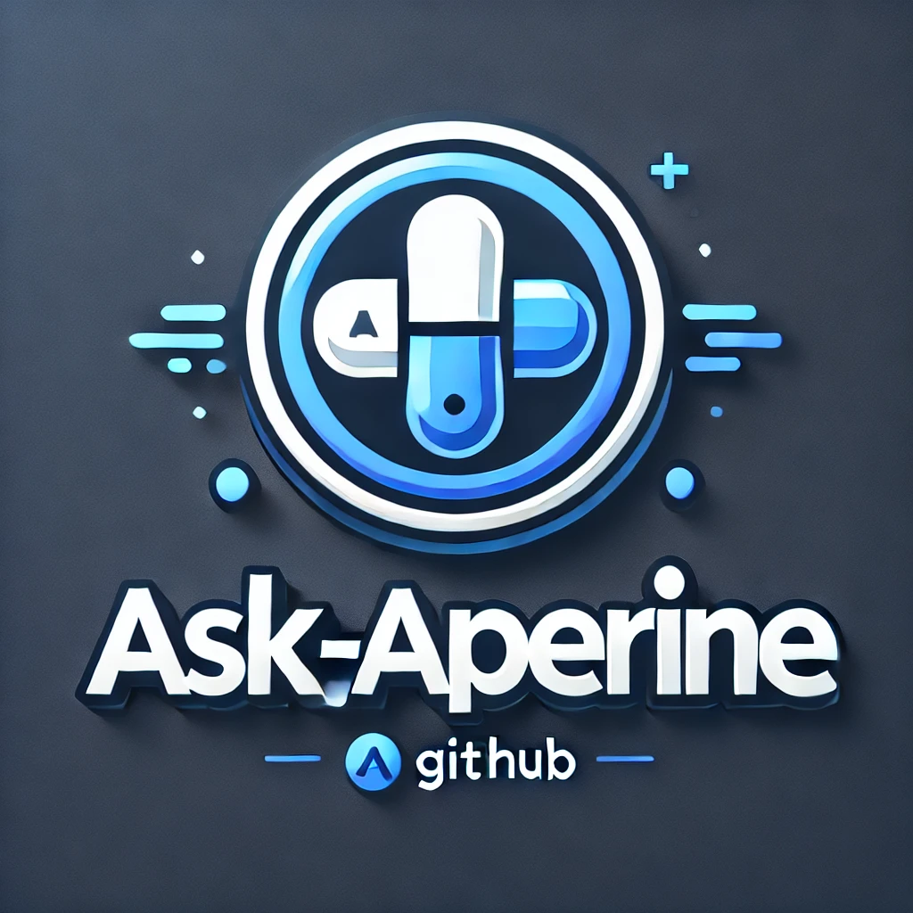

# 🎤 Ask\_Asperine - Chatbot sur l'Aspirine

## 📌 Description

Ask\_Asperine est un **chatbot interactif** développé en **Python avec Flask**. Il répond aux questions concernant l'aspirine, incluant son histoire, sa synthèse, ses utilisations (passées et actuelles) et ses effets secondaires.

✨ **Ce projet inclut :**

- 💻 **Interface web moderne** (Bootstrap)
- 🎵 **Musique de fond** (lecture automatique dans le navigateur)
- 📚 **Mini base de données** sur l'aspirine (stockée sous forme de dictionnaire Python)
- 💾 **Version exécutable (.exe)** pour une utilisation sans installation de Python

## 🚀 Fonctionnalités

- 🤖 Réponses interactives sur divers aspects de l'aspirine
- 🔊 Lecture automatique de la musique de fond (le site s'ouvre automatiquement dans le navigateur)
- 🗄 Affichage optimisé des réponses (listes, cartes, etc.)
- 📂 Accès à une mini base de données locale

## 🛠️ Installation et Utilisation

### 1️⃣Cloner le projet

```bash
git clone https://github.com/Touti-Sudo/Ask_Asperine.git
cd Ask_Asperine
```

### 2️⃣Installer les dépendances (si vous utilisez Python)

Assurez-vous d'avoir Python installé, puis lancez :

```bash
pip install flask requests
```

### 3️⃣Lancer l'application

🐍 **Avec Python :**

```bash
python Ask_Asperine_Fr.py
```

🖥️ *Le site s'ouvrira automatiquement dans votre navigateur.*

💾 **Avec le fichier .exe (Windows) :**

1. 💽 Téléchargez **Ask\_Asperine.exe**.
2. 🖱️ Double-cliquez dessus pour lancer l'application.
3. 🌍 Le site s'ouvrira automatiquement dans votre navigateur.

## 📂 Structure du Projet

```
Ask_Asperine/
│── static/
│   ├── bootstrap/css/bootstrap.min.css
│   ├── bootstrap/js/bootstrap.bundle.min.js
│   ├── js/jquery-3.6.0.min.js
│   ├── audio/musique.mp3
│── templates/
│   └── index.html
│── Ask_Asperine.py
│── Ask_Asperine.exe   # Version exécutable pour Windows
│── README.md
```

## 🌟 Licence

Ce projet est sous licence **MIT**.

---

💡 **Développé par Touti-Sudo pour un projet de technologie.** 🎓

---

# 🎤 اسك\_أسبرين - روبوت محادثة حول الأسبرين

## 📌 الوصف

اسك\_أسبرين هو **روبوت محادثة تفاعلي** تم تطويره باستخدام **بايثون و Flask**. يجيب على الأسئلة المتعلقة بالأسبرين، بما في ذلك تاريخه، تصنيعه، استخداماته (القديمة والحالية)، وآثاره الجانبية.

✨ **يشمل هذا المشروع:**

- 💻 **واجهة ويب حديثة** (Bootstrap)
- 🎵 **تشغيل تلقائي للموسيقى الخلفية** (يفتح الموقع تلقائيًا في المتصفح)
- 📚 **قاعدة بيانات صغيرة** عن الأسبرين (مخزنة على شكل قاموس في Python)
- 💾 **إصدار تنفيذي (.exe)** للاستخدام بدون تثبيت بايثون

## 🚀 الميزات

- 🤖 إجابات تفاعلية حول مختلف جوانب الأسبرين
- 🔊 تشغيل تلقائي للموسيقى الخلفية (يفتح الموقع تلقائيًا في المتصفح)
- 🗄 عرض محسن للإجابات (قوائم، بطاقات، إلخ)
- 📂 الوصول إلى قاعدة بيانات محلية

## 🛠️ التثبيت والاستخدام

### 1️⃣ استنساخ المشروع

```bash
git clone https://github.com/Touti-Sudo/Ask_Asperine.git
cd Ask_Asperine
```

### 2️⃣ تثبيت المتطلبات (إذا كنت تستخدم بايثون)

تأكد من تثبيت بايثون، ثم قم بتشغيل:

```bash
pip install flask requests
```

### 3️⃣ تشغيل التطبيق

🐍 **باستخدام بايثون:**

```bash
python Ask_Asperine_Ar.py
```

🖥️ *سيفتح الموقع تلقائيًا في المتصفح.*

💾 **باستخدام الملف التنفيذي (.exe) لنظام Windows:**

1. 📥 قم بتنزيل **Ask\_Asperine.exe**.
2. 🖱️ انقر نقرًا مزدوجًا لبدء التطبيق.
3. 🌍 سيفتح الموقع تلقائيًا في المتصفح.

## 📂 هيكل المشروع

```
Ask_Asperine/
│── static/
│   ├── bootstrap/css/bootstrap.min.css
│   ├── bootstrap/js/bootstrap.bundle.min.js
│   ├── js/jquery-3.6.0.min.js
│   ├── audio/music.mp3
│── templates/
│   └── index.html
│── Ask_Asperine.py
│── Ask_Asperine.exe   # الإصدار التنفيذي لنظام Windows
│── README.md
```

## 📜 الترخيص

هذا المشروع مرخص بموجب **MIT**.

---

💡 **تم تطويره بواسطة Touti-Sudo كمشروع تقني.** 🎓

